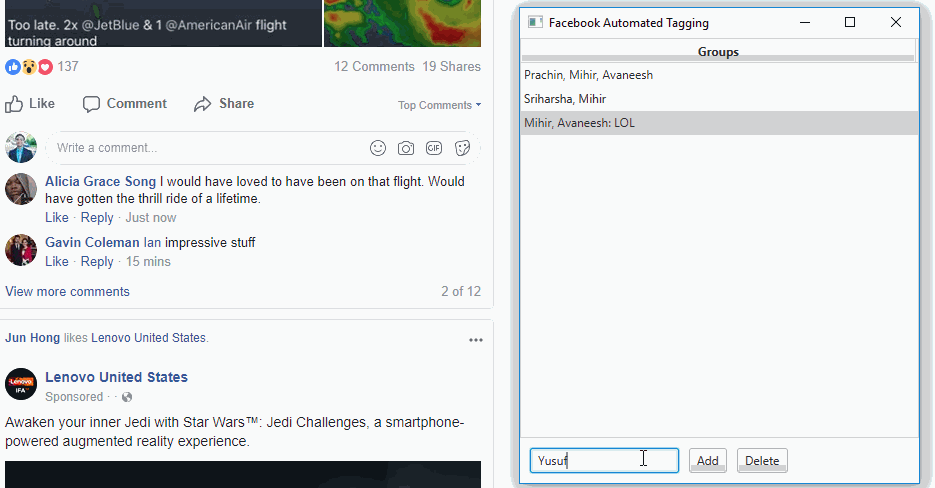

# Facebook Automated Tagger
This simple app lets you set groups of people that you can tag instantly, along with a signature. You can call it FAT for short.

## Demo

## Installation
Grab the Mac app, Windows .exe, or .jar file from the [releases](https://github.com/kirankunigiri/Facebook-Automated-Tagging/releases) page.

## Usage
Add your group with the following format to the table.

`person1, person2, personN: signature`

**people** - Separated by commas. It is recommended to use last initial or full name if you have multiple friends with the same first name, or your internet connection is slow.

**signature** - Optional. Use a colon at the end of the people list if you want to add  a signature.

****

There are 2 ways to **start an auto-tag:**

1. **Double-click a group row**

2. **Shortcut Keys:** Use the corresponding number key. For example, the first group uses the number 1, the second uses 2, etc.

## Examples

**Format:** `person1, person2, personN: signature`

`Eugene Hasso , Lupe Comier, Kenton Daversa`

`Gabriel Absten, Cheryl Salemi, Roger Sanderson: This is interesting, check it out.`

`Sahil R, Amogh S: LOL HAHA this is hilarious`

## Format Demo

